# IMPULSE

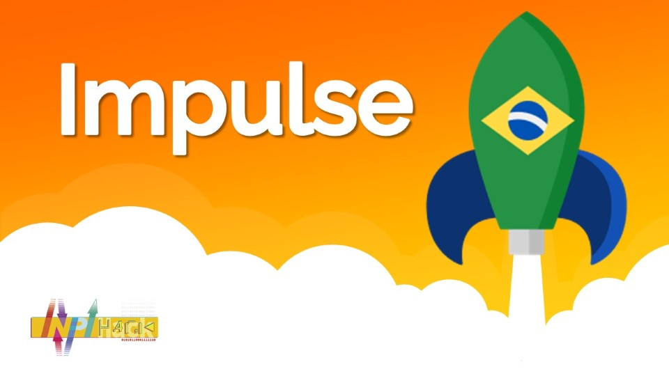
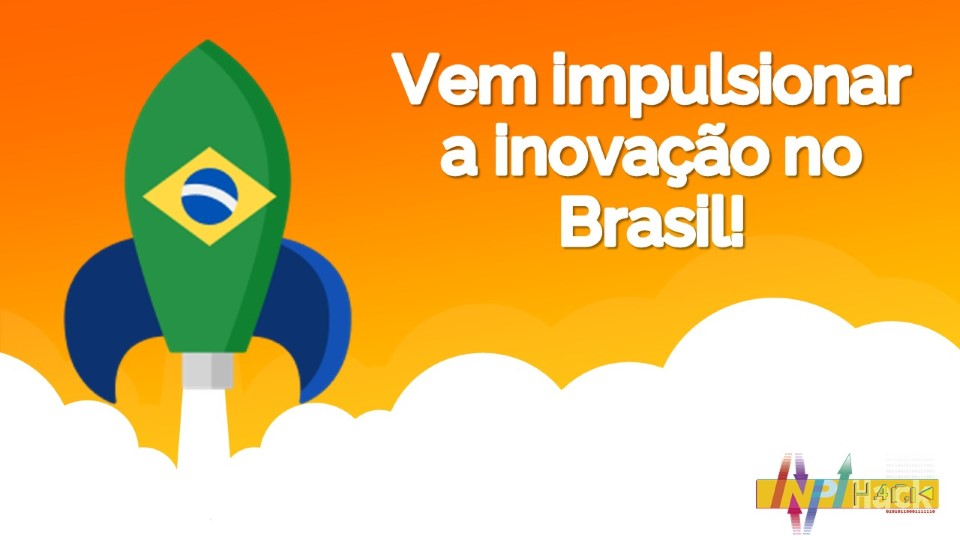

### Fluxograma do Aplicativo IMPULSE

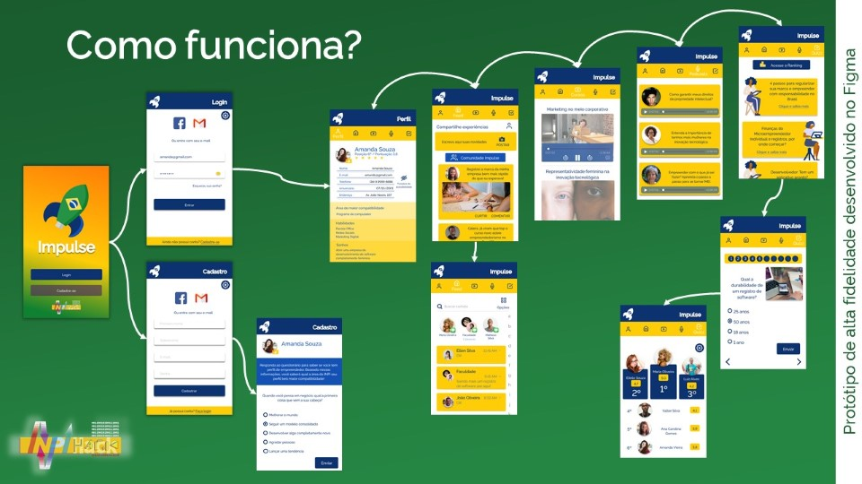

### Protótipo
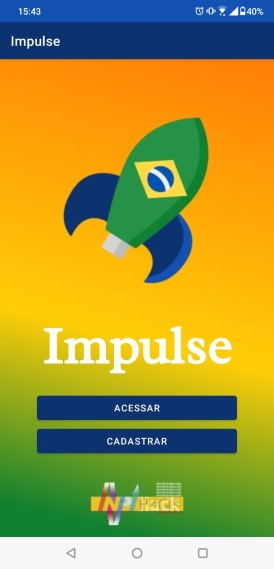
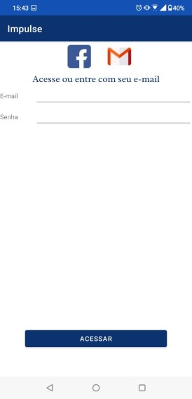
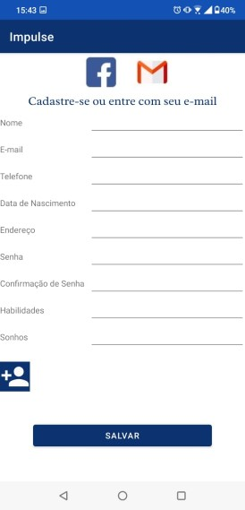
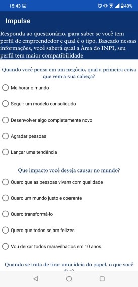
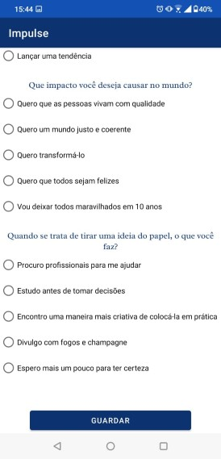
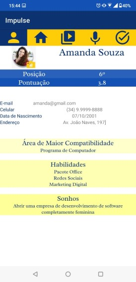
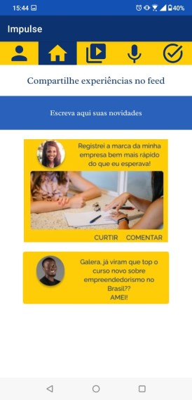
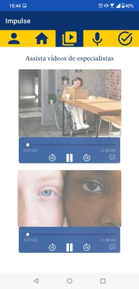
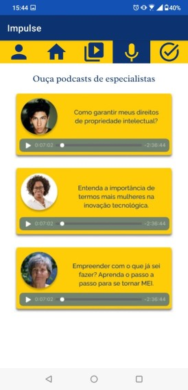

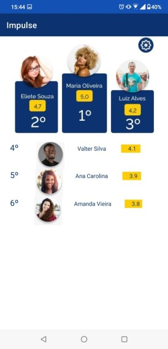
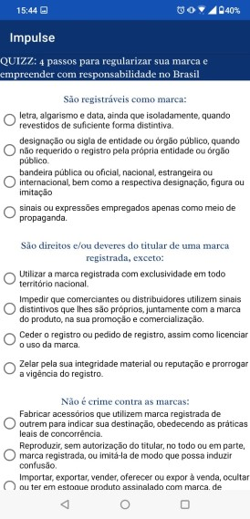
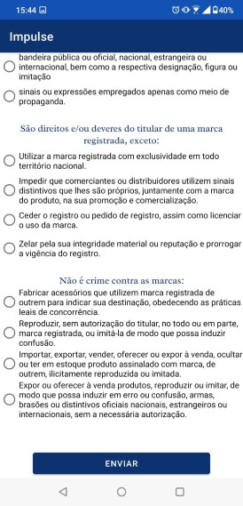

### Desenvolvimento

O desenvolvimento do app foi realizado com a IDE *Android Studio* e linguagem *Java*.

### Time

Nosso time é capacitado para desenvolver essa solução!

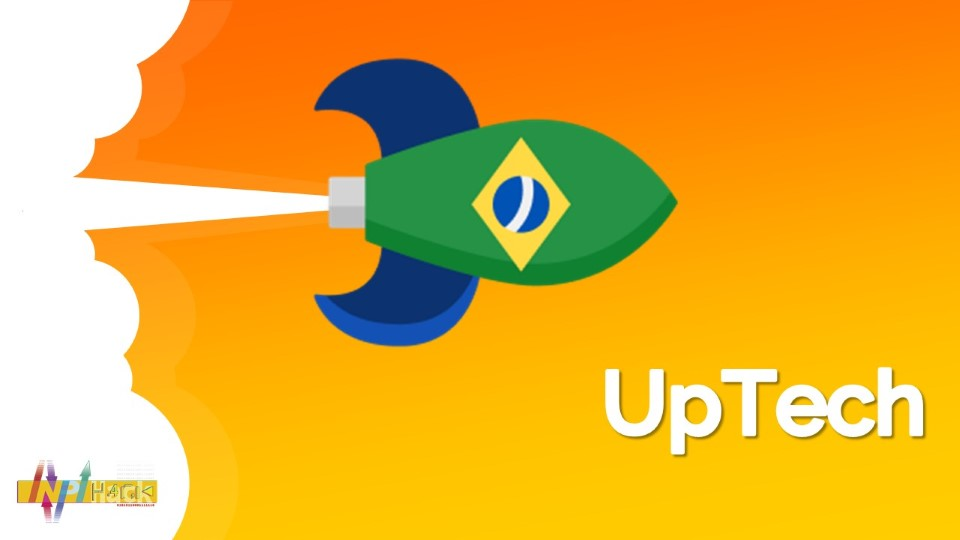

Responsável pelo Desenvolvimento do Protótipo em java

Responsável pelo Marketing do Pitch

Responsável pelo UX/UI do Pitch e Telas

